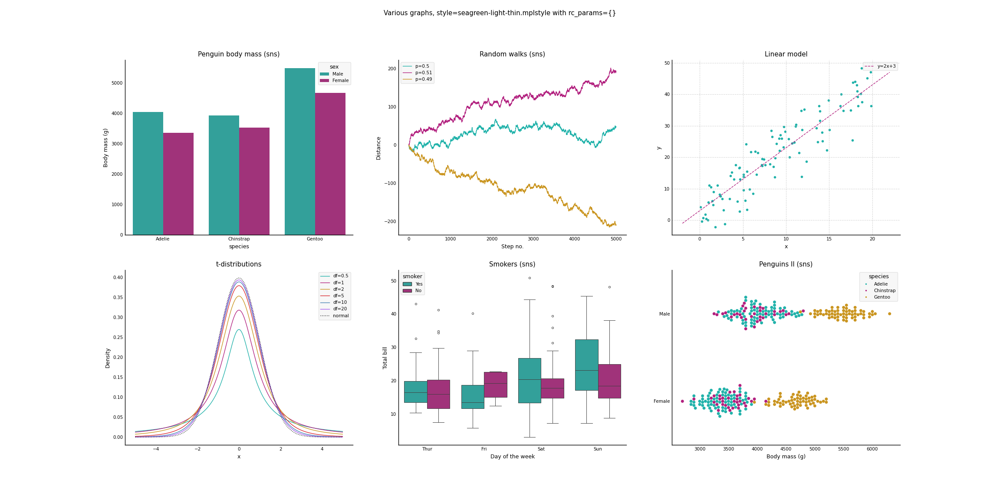

# matplotlibrc
My custom templates for Matplotlib/Seaborn. Also contains `testing_script.py` which can be used to test any `.mplstyle` file.

## Index
- `seagreen-light` and `lavender-dark` are two styles that aim to improve Matplotlib's default style
with a more pleasant color scheme and an elegant minimalist design. There are also *thick* (for better visibility)
and *thin* (lighter) variants.

- `navy` is a more academic style with dark colors on a white background.

## Examples
- seagreen-light-thick


- seagreen-light-thin



- lavender-dark-thick


- lavender-dark-thin


- navy


## How to Use
It is possible to load a `.mplstyle` file remotely

```python
import matplotlib.pyplot as plt
plt.style.use('https://raw.githubusercontent.com/lsimek/matplotlibrc/main/lavender-dark-thick.mplstyle')
```

Temporary or small changes to the configuration can be made with

```python
plt.rcParams.update({
	key: value,
	...
})
```


## Issues
- As can be seen in the examples, Seaborn will not use given colors for
elements of boxplots. 
- Since font stylings do not apply to LaTeX it is recommended to use
it sparingly in cases where the font is styled differently to LaTeX elements.

